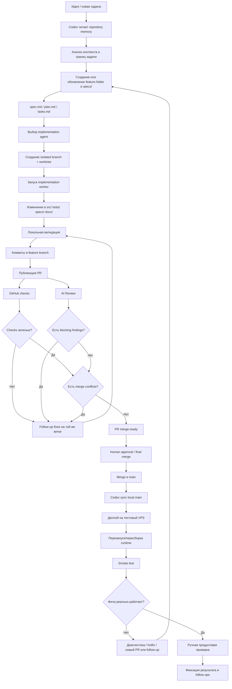
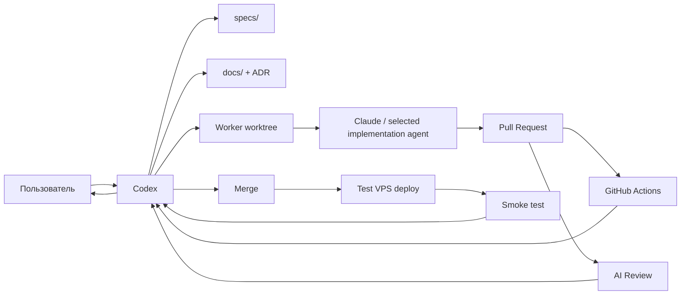
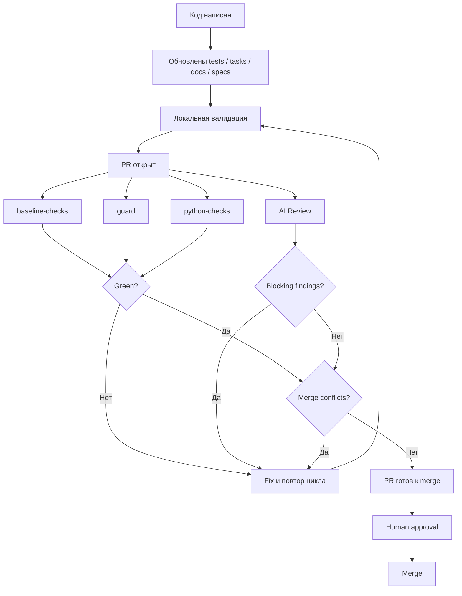
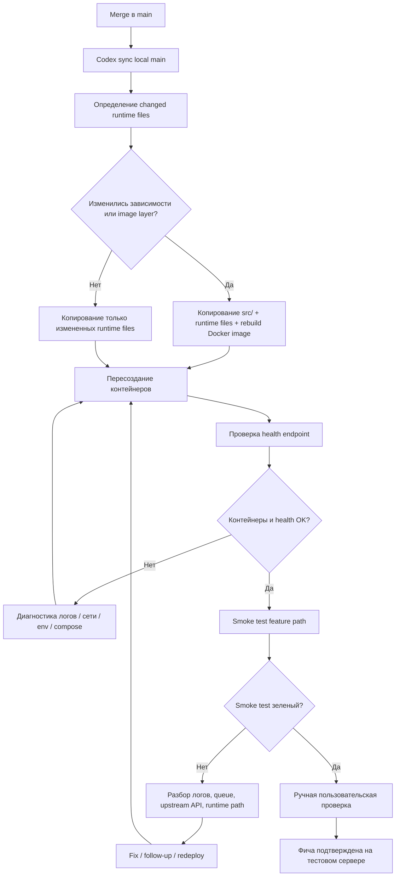
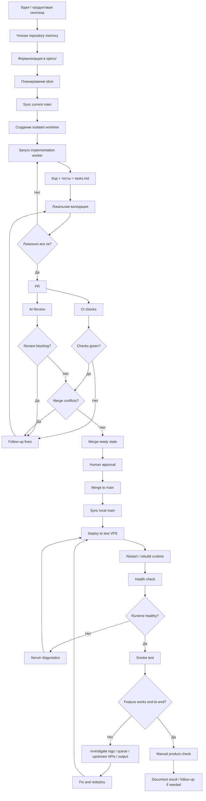

# Блок-схема процесса: от идеи до реализации и проверки на тестовом сервере

## Назначение документа

Этот файл показывает **сквозной delivery flow** проекта:

- от появления идеи
- до формализации задачи
- до реализации через implementation-агента
- до PR-loop и приемки кода
- до выкладки на тестовый сервер
- до smoke test и проверки пользовательского сценария

Документ нужен как наглядная схема того, **как именно оркестратор ведет задачу по шагам**.

---

## 1. Краткая версия процесса

В проекте используется последовательность:

1. Появляется идея или новая задача
2. Оркестратор читает память проекта
3. Создается feature-spec
4. Поднимается isolated worktree
5. Вызывается implementation-agent
6. Код публикуется в PR
7. Проходит CI и AI review
8. При необходимости выполняются follow-up fix итерации
9. После приемки PR merge'ится в `main`
10. Новый код выкатывается на тестовый сервер
11. Проводится smoke test
12. Проверяется реальное поведение фичи
13. Фиксируются follow-ups или задача считается завершенной

---

## 2. Главная блок-схема

---

## 3. Схема ролей внутри потока

---

## 4. Пошаговый алгоритм оркестратора

Ниже — как оркестратор ведет задачу в реальном процессе.

### Шаг 1. Получение идеи

Пользователь формулирует:

- новую фичу
- архитектурное изменение
- bugfix
- optimization slice

Оркестратор не начинает писать код немедленно. Сначала он определяет:

- это продуктовая задача или process/worfklow задача
- нужно ли менять docs/specs
- есть ли уже связанный feature folder

### Шаг 2. Чтение памяти проекта

Оркестратор читает:

- `.specify/memory/constitution.md`
- `docs/`
- `ADR`
- релевантные `specs/`

Цель:

- не дублировать уже принятое решение
- не менять архитектуру молча
- не начинать задачу “с нуля в голове”

### Шаг 3. Формализация задачи

Создается новый feature folder или обновляется существующий:

- `spec.md`
- `plan.md`
- `tasks.md`

Здесь фиксируются:

- бизнесовый смысл
- scope
- out of scope
- технический подход
- acceptance criteria

### Шаг 4. Подготовка implementation loop

Оркестратор:

- синхронизирует `main`
- при необходимости выбирает implementation/review agent
- поднимает isolated worktree от актуального `main`

Цель:

- не допустить перемешивания задач
- дать implementation agent чистую среду

### Шаг 5. Запуск implementation agent

Implementation worker получает:

- feature folder
- task summary
- branch
- worktree
- инструкцию обновить tests и `tasks.md`

После этого он реализует узкий slice.

### Шаг 6. Локальная валидация

До публикации PR implementation agent должен:

- прогнать релевантные тесты
- убедиться, что код импортируется и работает
- обновить `tasks.md`
- при необходимости обновить docs/specs

### Шаг 7. PR и приемка

После публикации PR запускается формальная петля:

- `baseline-checks`
- `guard`
- `python-checks`
- `AI Review`

Оркестратор отслеживает:

- нет ли blocking findings
- все ли required checks зеленые
- нет ли merge conflicts

Если проблемы есть:

- делаются follow-up fixes
- на той же ветке
- в том же PR

### Шаг 8. Merge

PR merge'ится только когда:

- checks green
- blocking findings removed
- PR mergeable
- осталось только человеческое подтверждение

После merge оркестратор:

- синхронизирует local `main`
- удаляет временные worktree
- чистит временные branch

---

## 5. Схема приемки кода

### Важный принцип

Задача **не считается выполненной**, если:

- checks еще running
- AI Review еще не завершился
- findings еще не исправлены
- PR не mergeable

“Последний push” не является completion point.

---

## 6. Что происходит после merge

После merge задача еще не считается полностью закрытой, если фича должна быть
развернута и проверена на тестовом сервере.

### Шаги после merge:

1. синхронизировать local `main`
2. определить, какие runtime-файлы реально изменились
3. выложить их на тестовый VPS
4. если изменились зависимости — пересобрать image
5. перезапустить контейнеры / сервисы
6. проверить базовый health
7. провести feature smoke test
8. проверить логи, очередь и внешние интеграции
9. убедиться, что фича реально работает для пользователя

---

## 7. Блок-схема деплоя на тестовый сервер

---

## 8. Что включает smoke test

Smoke test зависит от типа фичи, но обычно включает:

- доступность `health`
- прием webhook или HTTP entrypoint
- прохождение очереди
- отработку worker
- успешные внешние вызовы
- финальный пользовательский output

### Для Telegram flow это обычно:

1. webhook принимает update
2. job попадает в Redis
3. worker берет job
4. adapter/extraction завершается
5. enrichment отрабатывает
6. analysis/translation завершаются
7. Telegram reply уходит пользователю

### Что оркестратор проверяет при smoke

- длину очереди
- логи `web`
- логи `worker`
- состояние контейнеров
- факт отправки ответа
- фактический текст ответа, если нужно проверить UX

---

## 9. Как именно оркестратор проверяет работоспособность фичи

После выкладки оркестратор обычно идет по такой последовательности:

### 1. Runtime health

- контейнеры подняты
- сервис healthy
- worker не рестартится циклически

### 2. Operational health

- очередь не забита
- нет свежих исключений в логах
- внешние интеграции доступны

### 3. Feature health

- новая фича действительно достигается через живой путь
- не просто “код обновлен”, а “поведение наблюдается снаружи”

### 4. UX health

- текст понятный
- секции рендерятся правильно
- мультиязычность не сломалась
- пользовательский сценарий завершен

---

## 10. Детальная end-to-end схема

---

## 11. Основной смысл этого процесса

Эта схема показывает, что в проекте разработка не заканчивается на уровне:

- “код написан”
- “тесты локально зеленые”
- “PR открыт”

Полноценный delivery cycle завершается только когда:

1. фича прошла формализацию
2. код прошел PR-loop
3. изменения смержены
4. runtime обновлен на тестовом сервере
5. smoke test подтвердил работоспособность
6. пользовательский сценарий реально работает

---

## 12. Практический вывод

Оркестратор в этом процессе — это не просто “тот, кто пишет код”.

Он отвечает за полную цепочку:

- формализация
- orchestration
- implementation loop
- приемка
- deploy
- smoke test
- диагностика
- финальное подтверждение работоспособности

Именно эта сквозная ответственность делает процесс демонстрационно ценным.
