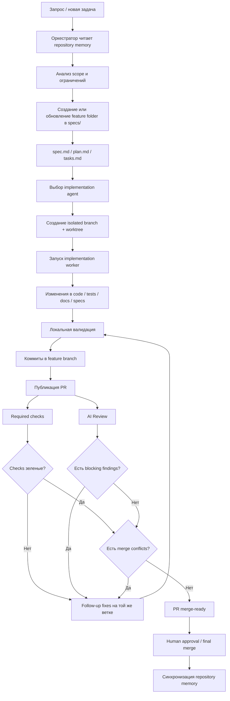
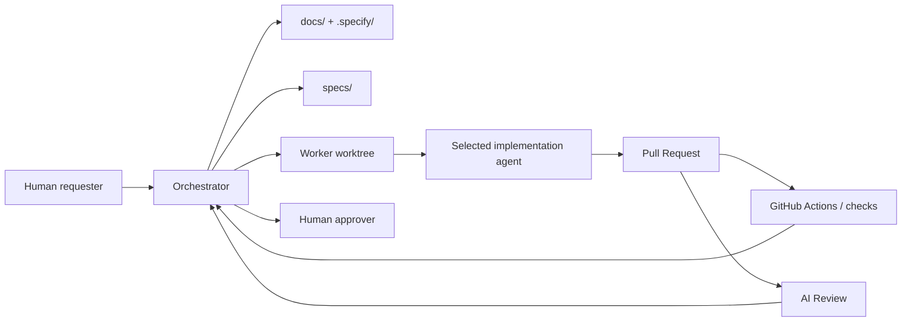
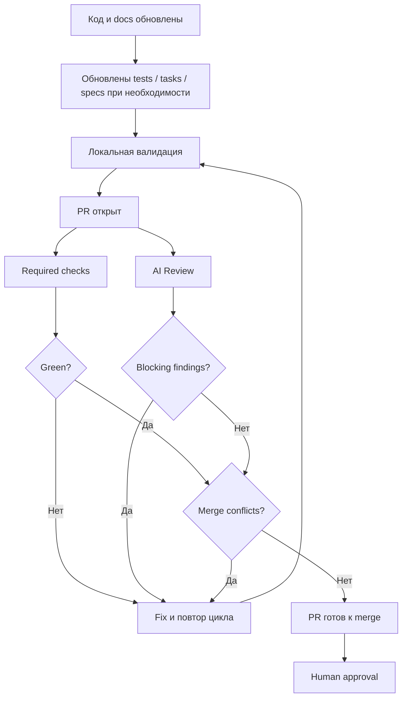

# Блок-схема процесса: от запроса до merge-ready delivery

## Назначение документа

Этот файл показывает сквозной delivery flow для репозитория с явной
repository memory и spec-driven orchestration.

Документ описывает путь:

- от запроса или идеи
- до формализации через `spec.md`, `plan.md`, `tasks.md`
- до isolated implementation loop
- до PR, checks и AI review
- до merge-ready состояния
- до фиксации результата в repository memory

## 1. Краткая версия процесса

1. Появляется запрос или новая задача
2. Оркестратор читает repository memory
3. Создается или обновляется feature folder в `specs/`
4. Поднимается isolated branch/worktree
5. Вызывается implementation agent
6. Изменения публикуются в PR
7. Проходят checks и AI review
8. При необходимости выполняются follow-up fixes
9. PR доводится до merge-ready состояния
10. Человек принимает решение о merge
11. Итог и follow-ups возвращаются в docs/specs

## 2. Главная блок-схема

## 3. Схема ролей внутри потока

## 4. Пошаговый алгоритм оркестратора

### Шаг 1. Получение задачи

Оркестратор определяет:

- что именно нужно изменить
- это product-code задача или process/doc задача
- есть ли уже релевантный feature folder

### Шаг 2. Чтение памяти проекта

Оркестратор сначала читает:

- `.specify/memory/constitution.md`
- `docs/`
- `ADR`
- релевантные `specs/`

Только после этого имеет смысл читать implementation files.

### Шаг 3. Формализация задачи

В `specs/<feature-id>/` фиксируются:

- intent и scope
- technical plan
- execution checklist

### Шаг 4. Подготовка implementation loop

Для product-code задачи оркестратор:

- стартует от текущего `main`
- создает isolated branch/worktree
- выбирает implementation agent

### Шаг 5. Реализация

Implementation agent:

- реализует узкий согласованный slice
- обновляет тесты при изменении поведения
- синхронизирует `tasks.md`

### Шаг 6. PR и приемка

После публикации PR проходят:

- required checks
- AI review
- follow-up fixes на той же ветке, если есть замечания

### Шаг 7. Completion

PR считается готовым только если:

- required checks green
- blocking findings отсутствуют
- merge conflicts отсутствуют
- остались только human approval или final merge

## 5. Схема приемки кода

## 6. Что фиксируется после merge

После завершения цикла нужно обновить repository memory:

1. синхронизировать `tasks.md`
2. зафиксировать устойчивые решения в `docs/` или `docs/adr/`
3. занести follow-ups в текущий feature folder или новый spec

## 7. Главный смысл процесса

Процесс нужен, чтобы разработка не сводилась к состоянию:

- "код написан"
- "локально вроде работает"
- "PR открыт"

Completion point здесь другой:

- задача формализована
- изменения reviewable
- quality gates пройдены
- состояние репозитория и repository memory согласованы между собой
