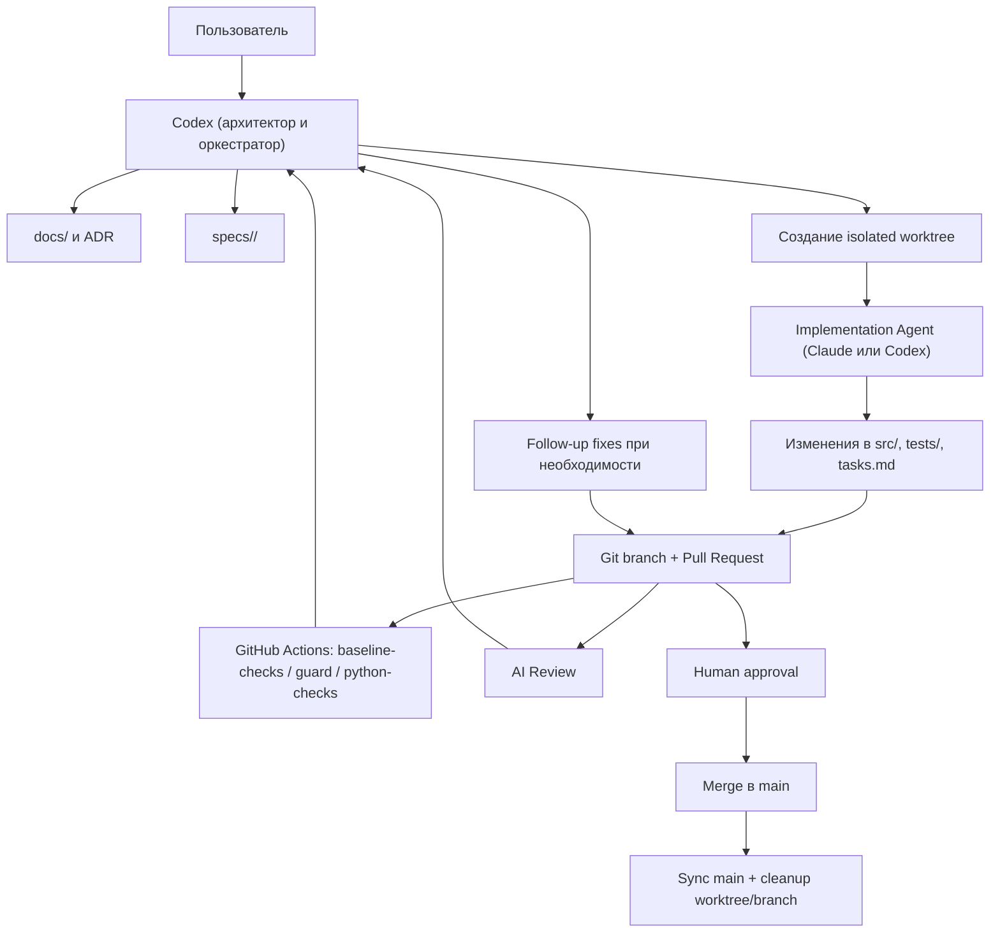
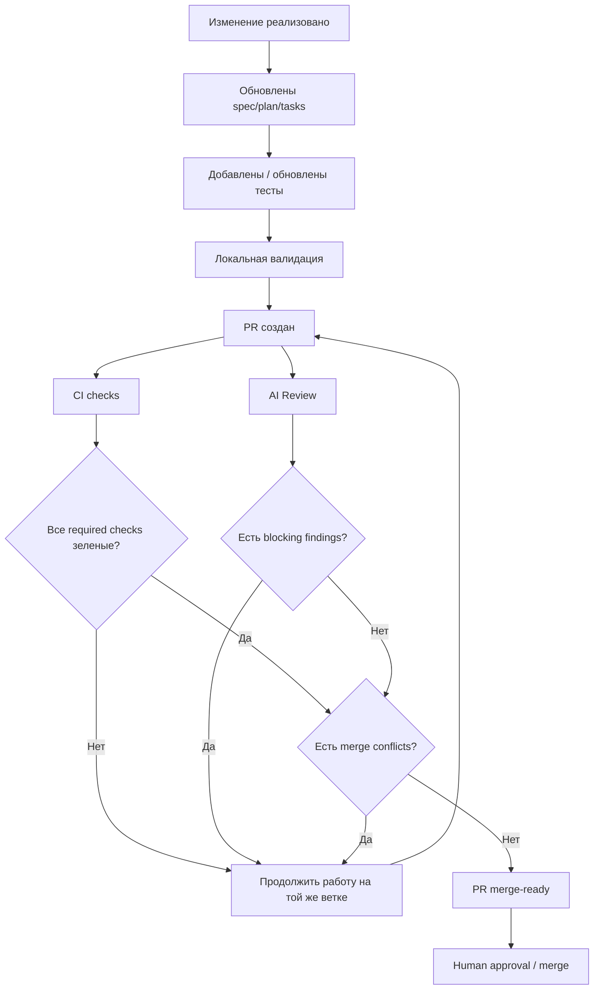

# flatscanner: устройство проекта и алгоритм разработки

## Зачем нужен этот документ

`flatscanner` — это не только продуктовый Telegram-бот для анализа объявлений об аренде.
Этот репозиторий также служит **демонстрационным проектом**, на котором показан
spec-driven и AI-assisted алгоритм разработки:

- как фиксируется задача до написания кода
- как хранится долговременная память проекта
- как оркестратор управляет implementation-агентами
- как проходят PR, CI и AI review
- как код доводится до состояния merge-ready

Документ описывает:

1. структуру репозитория
2. назначение папок и файлов
3. роли участников процесса
4. алгоритм разработки от постановки задачи до merge
5. петлю оркестрации, CI и приемки кода

---

## 1. Кратко о подходе

В этом проекте используется подход:

- **Specs before code** — сначала формализуем задачу, потом меняем код
- **Repository memory over session memory** — важный контекст хранится в репозитории, а не в скрытой памяти чата
- **Small PRs** — изменения вносятся маленькими reviewable срезами
- **Role separation** — архитектура, реализация и автоматизированный review разделены по ролям
- **Completion = green PR loop** — задача считается завершенной только когда PR действительно готов к merge

Это делает разработку:

- воспроизводимой
- прозрачной
- масштабируемой через агентов
- устойчивой к потере контекста между сессиями

---

## 2. Основная идея репозитория

В репозитории есть две главные памяти:

- `docs/` — **долговременная память проекта**
- `specs/<feature-id>/` — **память конкретной задачи**

Именно это разделение является ядром процесса.

### `docs/` отвечает за:

- устойчивое описание продукта
- стабильные архитектурные решения
- ADR
- workflow и операционные правила

### `specs/` отвечает за:

- что именно сейчас делается
- зачем это делается
- каким способом это делается
- какие шаги уже выполнены

Идея простая:

- `docs/` — знание, которое должно пережить много фич
- `specs/` — знание, которое относится к одной фиче или одному этапу

---

## 3. Структура репозитория

Ниже — карта основных папок.

### `.specify/`

Служебный каркас spec-driven процесса.

Что хранится:

- конституция процесса
- шаблоны spec/plan/tasks
- процессные правила

Ключевой файл:

- `.specify/memory/constitution.md`

Это верхнеуровневый контракт процесса.

### `docs/`

Долговременная память проекта.

Типовые файлы:

- `docs/README.md` — как использовать слой `docs/`
- `docs/project-idea.md` — продуктовая идея
- `docs/project/backend/backend-docs.md` — backend shape, stack, ограничения, migration direction
- `docs/project/frontend/frontend-docs.md` — frontend guidance
- `docs/adr/*.md` — архитектурные решения
- `docs/ai-pr-workflow.md` — канонический PR-loop
- `docs/claude-worker-orchestration.md` — локальный orchestration flow для implementation workers
- `docs/project/backend/self-hosted-runner.md` — устройство self-hosted AI review runner

### `specs/`

Папки активных и исторических фич.

Каждая фича обычно содержит:

- `spec.md` — что именно строим
- `plan.md` — как именно строим
- `tasks.md` — состояние выполнения

Пример:

- `specs/001-telegram-listing-analysis-mvp/`
- `specs/018-analysis-module-framework/`
- `specs/023-review-analysis-skill-and-unified-corpus/`

### `src/`

Продуктовый код приложения.

Основные зоны:

- `src/telegram/` — Telegram intake, меню, formatter, sender
- `src/adapters/` — provider detection и extraction
- `src/domain/` — нормализованные доменные модели
- `src/enrichment/` — дополнительные провайдеры данных
- `src/analysis/` — analysis services, module framework, specialist modules
- `src/jobs/` — очереди, processor, worker loop
- `src/storage/` — persistence layer
- `src/i18n/` — мультиязычные системные строки
- `src/translation/` — on-demand translation layer

### `tests/`

Автоматические тесты.

Здесь фиксируются:

- unit tests
- integration tests
- regression tests

Тесты являются частью контракта изменения, а не “дополнительной опцией”.

### `scripts/`

Служебные скрипты проекта.

Что сюда входит:

- orchestration локальных implementation workers
- настройка implementation/review agent
- PR publishing
- AI review helpers
- self-hosted runner setup
- тесты process tooling

Примеры:

- `scripts/new-claude-worktree.ps1`
- `scripts/start-implementation-worker.ps1`
- `scripts/set-implementation-agent.ps1`
- `scripts/publish-claude-branch.ps1`
- `scripts/run-ai-pr-review.ps1`

### `skills/`

Репозиторные skills — повторно используемые инструкции для специализированных подзадач.

Пример:

- `skills/review-analysis/`

Это слой reusable guidance для будущих фич и агентов.

### `.github/`

GitHub workflows, prompts и CI/CD конфигурация.

Здесь живет:

- запуск CI
- AI review workflow
- prompt template для implementation worker

### Корень проекта

В корне лежат:

- `AGENTS.md` — главный контракт ролей и правил
- `README.md` — общий входной документ
- `pyproject.toml` — зависимости и конфигурация Python-проекта
- `Dockerfile` — контейнеризация

---

## 4. Что где хранится и почему

### Где хранится долговременная архитектурная память

В `docs/` и `docs/adr/`.

Сюда попадает то, что не должно исчезать после закрытия одной задачи:

- направления архитектуры
- роли агентов
- правила CI / review / orchestration
- решения по слоям системы

### Где хранится активная память по задаче

В `specs/<feature-id>/`.

Эта папка фиксирует:

- бизнес-контекст задачи
- границы scope
- технический подход
- checklist реализации

### Где хранится продуктовая логика

В `src/`.

Это runtime-часть системы:

- bot
- adapters
- analysis
- jobs
- storage

### Где хранится проверка поведения

В `tests/`.

Это обязательная часть изменения поведения.

### Где хранится orchestration логика разработки

В `scripts/`.

Здесь живут скрипты, которыми оркестратор:

- создает worktree
- выбирает implementation/review agent
- публикует ветки и PR
- управляет AI review tooling

---

## 5. Роли в процессе

В проекте роли разделены принципиально.

### Пользователь

Пользователь:

- задает цель
- утверждает направление
- принимает продуктовые решения
- является финальным владельцем процесса

### Codex

Codex — это:

- архитектор
- reviewer
- владелец CI/CD и workflow health
- оркестратор implementation loop

Responsibility area Codex:

- читать и синхронизировать repository memory
- формулировать spec/plan/tasks
- выбирать следующий implementation slice
- запускать worker в isolated worktree
- проверять diff
- контролировать тесты и PR checks
- доводить PR loop до merge-ready
- обновлять docs и ADR при архитектурных изменениях

### Claude Code

Claude Code — primary implementation agent для продуктового кода.

Responsibility area Claude:

- реализовывать согласованный slice
- работать в отдельной ветке и отдельном worktree
- обновлять `tasks.md`
- прогонять тесты
- коммитить результат
- публиковать PR

### GitHub Actions / self-hosted runner

CI и AI review обеспечивают формальную приемку.

Они отвечают за:

- `baseline-checks`
- `guard`
- `python-checks`
- `AI Review`

### Human approval

Финальный merge — всегда человеческое решение, даже если все автоматические проверки зелёные.

---

## 6. Алгоритм разработки от задачи до merge

Ниже — стандартный рабочий цикл.

### Шаг 1. Постановка задачи

Пользователь формулирует новую задачу или новый этап.

Оркестратор не начинает с кода. Он сначала уточняет:

- что именно нужно сделать
- относится ли задача к архитектуре, продукту, инфраструктуре или workflow
- есть ли уже похожий контекст в `docs/` и `specs/`

### Шаг 2. Чтение памяти проекта

Перед планированием читаются репозиторные источники в фиксированном порядке:

1. `.specify/memory/constitution.md`
2. `docs/README.md`
3. `docs/project-idea.md`
4. `docs/project/frontend/frontend-docs.md`
5. `docs/project/backend/backend-docs.md`
6. `docs/adr/*.md`
7. `specs/*/spec.md`
8. `specs/*/plan.md`
9. `specs/*/tasks.md`
10. только потом — implementation files

Это гарантирует, что код меняется не “из головы”, а из контекста проекта.

### Шаг 3. Формализация фичи

Для новой задачи создается или обновляется feature folder в `specs/`.

Минимальный набор:

- `spec.md`
- `plan.md`
- `tasks.md`

Здесь фиксируются:

- цель
- scope
- out of scope
- контракты
- acceptance criteria
- шаги реализации

### Шаг 4. Выбор implementation и review agents

По умолчанию:

- implementation agent = `claude`
- review agent = `claude`

Если нужно, это можно переключить вручную через:

```powershell
scripts/set-implementation-agent.ps1 -Agent claude
scripts/set-implementation-agent.ps1 -Agent codex
```

Этот шаг:

- пишет локальный implementation agent в `.codex/implementation-agent`
- обновляет repo variable `AI_REVIEW_AGENT`

Никакого автоматического failover в проекте нет.

### Шаг 5. Создание isolated worktree

Оркестратор всегда стартует новую задачу от текущего `main`.

Потом создается отдельный branch/worktree:

```powershell
scripts/new-claude-worktree.ps1 -FeatureFolder <feature> -TaskSlug <task>
```

Правило:

- один worker = одна задача = одна ветка = один worktree = один PR

### Шаг 6. Запуск implementation worker

Оркестратор запускает implementation agent через dispatcher:

```powershell
scripts/start-implementation-worker.ps1 ...
```

Dispatcher смотрит на `.codex/implementation-agent` и выбирает:

- `start-claude-worker.ps1`
- или `start-codex-worker.ps1`

Worker получает:

- feature folder
- task summary
- branch
- isolated worktree
- правила обновления tasks/tests

### Шаг 7. Реализация

Implementation agent:

- меняет продуктовый код
- обновляет `tasks.md`
- добавляет/обновляет тесты
- прогоняет валидацию
- коммитит изменения

### Шаг 8. Публикация PR

После локального завершения worker публикует ветку и открывает PR:

```powershell
scripts/publish-claude-branch.ps1 ...
```

### Шаг 9. PR loop

После открытия PR запускается стандартная петля:

- `baseline-checks`
- `guard`
- `python-checks`
- `AI Review`

Если review или checks находят проблему:

- работа продолжается на той же ветке
- PR не считается завершенным
- follow-up делается до тех пор, пока текущий head SHA не станет merge-ready

### Шаг 10. Приемка и merge

PR считается готовым только когда одновременно выполнены все условия:

1. нет blocking findings
2. required checks зеленые
3. PR mergeable
4. осталось только human approval / final merge

Только после этого возможен merge.

### Шаг 11. Синхронизация main

После merge:

- локальный `main` синхронизируется
- временные worktree удаляются
- временные branch cleanup выполняются
- follow-up фиксируются в docs/specs при необходимости

---

## 7. Как агенты обмениваются информацией

Очень важная часть подхода:

агенты **не должны опираться на скрытый контекст сессии** как на единственный источник истины.

Информация передается через репозиторий.

### Основные каналы передачи знаний

#### `docs/`

Передает долгоживущий контекст:

- продукт
- архитектура
- процесс
- ADR

#### `specs/<feature-id>/`

Передает локальный контекст задачи:

- что строим
- как строим
- что уже сделано

#### `tasks.md`

Передает текущее состояние реализации между сессиями и агентами.

#### Git history / PR

Передает:

- change intent
- review findings
- corrective fixes

#### `skills/`

Передают reusable domain-specific guidance.

Пример:

- review-analysis skill

Это важно потому, что позволяет:

- безопасно переключать implementation agents
- не терять контекст между разными циклами
- повторять workflow воспроизводимо

---

## 8. Схема orchestration

Ниже — упрощенная схема основного процесса.



Смысл этой схемы:

- пользователь не общается с implementation agent напрямую как с владельцем архитектуры
- Codex держит общий контур и принимает решения о следующем шаге
- знания возвращаются обратно в репозиторий

---

## 9. Схема приемки кода

Код не считается “готовым”, если он просто написан и локально работает.

В этом процессе приемка устроена как последовательность quality gates.



Главный принцип:

**“Последний push” не означает завершение задачи.**

Задача завершена только тогда, когда текущий head SHA PR действительно прошел приемку.

---

## 10. Практические правила процесса

### 1. Всегда стартовать от текущего `main`

Новая задача не должна начинаться от старой feature branch.

### 2. Один worker — один isolated worktree

Нельзя запускать несколько coding agents в одном рабочем дереве.

### 3. Specs и docs обновляются не после факта, а как часть изменения

Если меняется поведение или архитектура, это должно быть отражено в repository memory.

### 4. Не тащить скрытый контекст

Истина должна жить в:

- `docs/`
- `specs/`
- `ADR`
- `tests/`

### 5. Один PR — один внятный slice

Избегать больших бесформенных PR.

### 6. Оркестратор не заканчивает работу на “checks running”

Если checks еще не зеленые или findings еще есть — задача все еще активна.

---

## 11. Почему этот подход полезен

### Воспроизводимость

Новая сессия или новый агент может продолжить работу, прочитав репозиторий.

### Прозрачность

Почти каждое решение фиксируется в явном виде:

- spec
- plan
- tasks
- ADR
- PR

### Масштабируемость

Можно безопасно подключать implementation agents без разрушения общего контура.

### Снижение хаоса

Процесс не дает слишком рано “прыгать в код”.

### Демонстрационная ценность

Репозиторий показывает не только код продукта, но и сам алгоритм разработки как системный артефакт.

---

## 12. Ограничения и trade-offs

Подход не бесплатный.

### Есть overhead

Нужно поддерживать:

- docs
- specs
- tasks
- review loop

### Не подходит для хаотичного прототипирования

Если цель — “накидать код за 20 минут”, процесс может казаться тяжелым.

### Требует дисциплины

Если игнорировать:

- обновление `tasks.md`
- docs
- PR loop

то вся система быстро деградирует.

### Усложняет первые шаги, но упрощает длинную дистанцию

Это не оптимизация под самую первую правку. Это оптимизация под:

- серию задач
- смену контекста
- работу нескольких агентов
- накопление архитектурной памяти

---

## 13. Как читать проект новому участнику

Рекомендуемый порядок входа:

1. [C:\Users\User\FlatProject\flatscanner\.specify\memory\constitution.md](C:\Users\User\FlatProject\flatscanner\.specify\memory\constitution.md)
2. [C:\Users\User\FlatProject\flatscanner\docs\README.md](C:\Users\User\FlatProject\flatscanner\docs\README.md)
3. [C:\Users\User\FlatProject\flatscanner\docs\project-idea.md](C:\Users\User\FlatProject\flatscanner\docs\project-idea.md)
4. [C:\Users\User\FlatProject\flatscanner\docs\project\backend\backend-docs.md](C:\Users\User\FlatProject\flatscanner\docs\project\backend\backend-docs.md)
5. [C:\Users\User\FlatProject\flatscanner\docs\ai-pr-workflow.md](C:\Users\User\FlatProject\flatscanner\docs\ai-pr-workflow.md)
6. [C:\Users\User\FlatProject\flatscanner\docs\claude-worker-orchestration.md](C:\Users\User\FlatProject\flatscanner\docs\claude-worker-orchestration.md)
7. актуальный `specs/<feature-id>/`
8. только потом — продуктовый код в `src/`

---

## 14. Итог

`flatscanner` демонстрирует не только backend-продукт, но и **алгоритм управляемой AI-assisted разработки**.

Его основные свойства:

- repository-driven memory
- spec-first execution
- role separation
- isolated implementation workers
- обязательный PR loop
- формальная приемка через CI и AI review

Именно это делает проект пригодным как:

- для развития продукта
- для демонстрации процесса
- для масштабирования команды людей и агентов в одном репозитории
